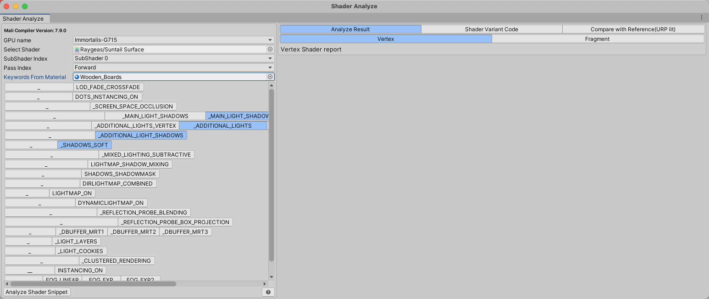
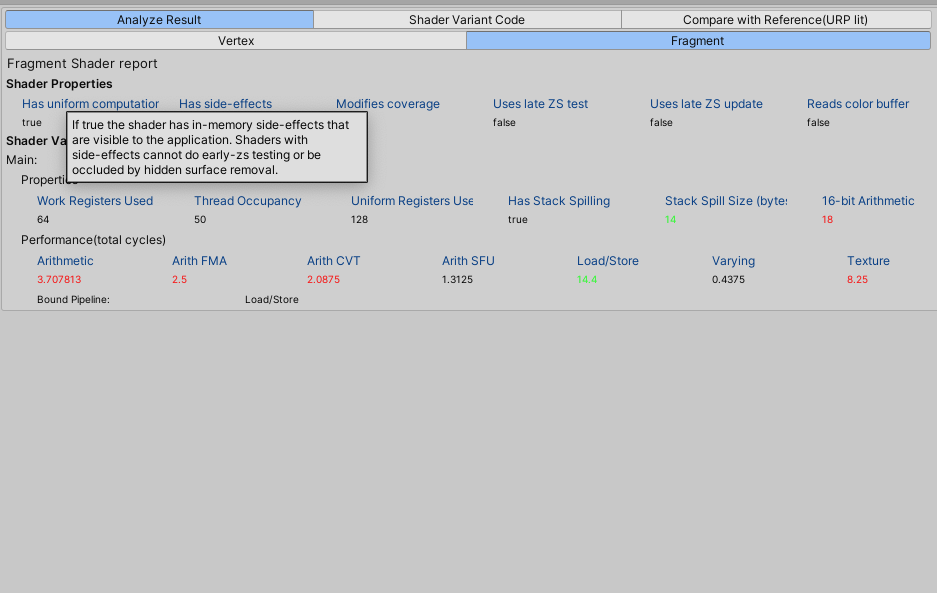
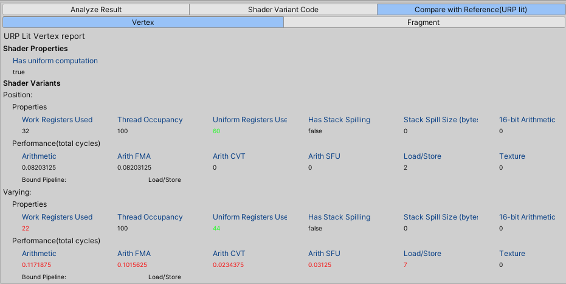
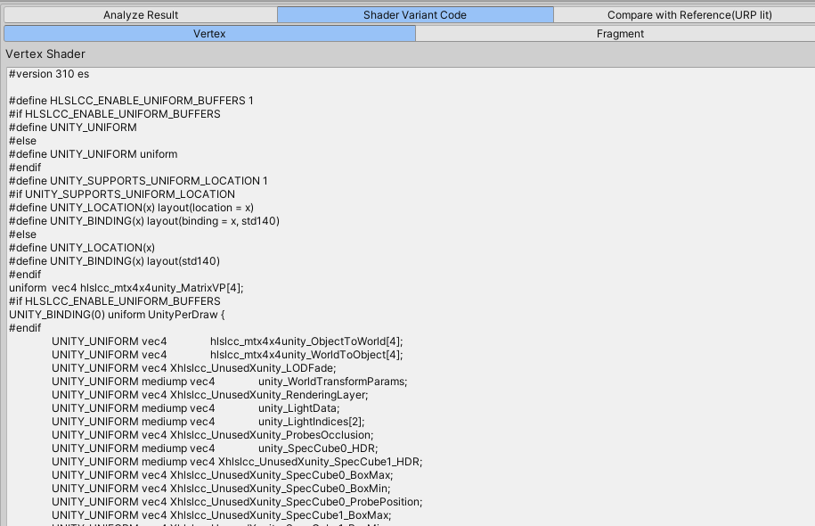
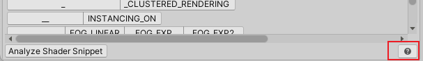

# ShaderInspector

Analyze shader performance metrics using the [malioc](https://developer.arm.com/Tools%20and%20Software/Mali%20Offline%20Compiler) offline shader compiler tool.

# Usage

On first use, you need to install the Mali Offline Shader Compiler. Click to visit the ARM official website to install it, or if you have already installed it, click `...` to select the path where the malioc executable is located.

It usually laids in `Arm Performance Studio XXXX/mali_offline_compiler`

Main Interface

* Open the Package Manager and add the package from a local source
* Click Window => Analysis => Shader Inspector to open the tool
* Select the GPU according to the target device (performance metrics vary greatly across different models)
* Select the shader, subshader index, and pass index
* Select the enabled keywords, or import the enabled keywords directly from a material
* Click Analyze

Analysis Report

* The report is divided into vertex and fragment sections. Hover over each metric to view its meaning.
* Text color reflects the change in the current shader's metrics compared to the previous report: red for an increase, green for a decrease, and black for no change.
* Select Compare with Reference to view metrics using URP Lit as a reference standard; the color indicates the difference compared to URP Lit.
  

Variant GLSL Code

# Meaning of the Performance Report

Click the question mark to jump to ARM's help documentation.

The report is divided into two sections: vertex and fragment. On Mali GPUs, the vertex stage is split into position and varying blocks. Instructions for varying are only executed for visible portions, while position instructions execute for every vertex index.

Key focus areas:
* Number of registers used: fewer registers allow the GPU to process more threads in parallel.
* Percentage of half-precision arithmetic (16-bit Arithmetic): half-precision operations consume half the power of single-precision operations.
* Number of shader instruction cycles (cycles): more instructions mean higher execution cost. Instructions are categorized as:
   * Arithmetic operations (arith_total), which on Valhall are further divided into:
      * Fused multiply accumulate (arith_fma)
      * Arithmetic conversion (arith_cvt)
      * Special functions unit (arith_sfu)
   * Load/store operations (load_store)
   * Texture sampling (texture)
* [shader properties](https://developer.arm.com/documentation/101863/0800/Using-Mali-Offline-Compiler/Performance-analysis/Shader-properties?lang=en), such as:
   * Has uniform computation: calculations on uniform variables whose results do not change during rendering and can be moved outside the shader
   * Modifies coverage: whether visibility is modified, affecting early-z effectiveness

## References:
* [Arm Mali Offline Compiler User Guide](https://developer.arm.com/documentation/101863/0800?lang=en)
* [Arm Mali GPU Training - Episode 3.5: Mali Offline Compiler](https://developer.arm.com/Additional%20Resources/Video%20Tutorials/Arm%20Mali%20GPU%20Training%20-%20EP3-5)
* [IDVS shader variants](https://developer.arm.com/documentation/101863/0800/Using-Mali-Offline-Compiler/Performance-analysis/IDVS-shader-variants)